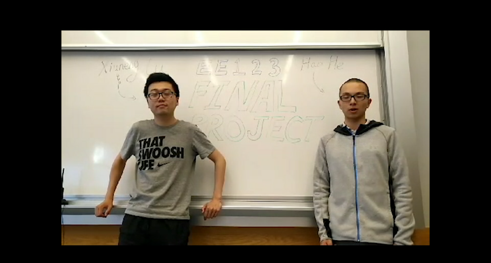

## Image-Communication-Project
The aim of the project is to send the best quality image in 75 seconds using ham radio.

## Team Information
- College: University of California, Berkeley
- Institude: EECS 
- Instructor: Prof. Michael (Miki) Lustig
- Course: EE123: Digital Signal Processing
- Date: Apr. 2018

## Team Member
- Xiuneng Lu
- Hao He

## Demo
Here's our Demo Video:

